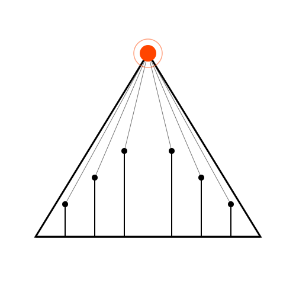

<div align="center">



# Delphi

**多智能体世界仿真与预测引擎**

[](./LICENSE)
[](https://nodejs.org)
[](https://www.python.org)

[English](./README.md) | [中文文档](./README-ZH.md)

</div>

## ⚡ 项目概述

Delphi 从现实世界的种子信息（一篇新闻、一份政策草案、一个金融信号，或是你想重新演绎的故事）出发，构建出高保真的平行数字世界。在此空间内，具备独立人格、长期记忆与行为逻辑的智能体自由交互、持续演化。你可以从上帝视角动态注入变量，观察这些动态如何展开——在沙盘中预演结果，而不必等到现实发生。

> 只需提供种子材料，并用自然语言描述你的预测问题。
> Delphi 会返回一份详尽的报告，以及一个可在模拟结束后持续深度交互的数字世界。

### 我们的愿景

- **于宏观**：为决策者提供零风险的预演实验室——在真正投入前测试政策、公关表达与市场策略
- **于微观**：为个人用户提供创意沙盘——推演小说的另一种结局，或探索任意的「如果」

## 🔄 工作流程

1. **图谱构建**：现实种子提取、个体与群体记忆注入、GraphRAG 构建
2. **环境搭建**：实体关系抽取、人设生成、智能体配置注入
3. **开始模拟**：多渠道并行模拟、自动解析预测需求、动态更新时序记忆
4. **报告生成**：报告智能体拥有丰富的工具集，可与模拟后的世界进行深度交互
5. **深度互动**：与模拟世界中的任意智能体对话，或与报告智能体对话

## 🧭 场景预设——适配不同领域

Delphi 并不假设单一的应用场景。活动节奏、时间跨度、沟通渠道、立场词汇与 LLM 提示词框架都被抽象为**配置驱动的场景预设**，使同一套引擎可以建模完全不同的世界：

| 预设 | 适用范围 |
|------|---------|
| `social_media`（默认） | 社交媒体舆论，单一时区 |
| `global_social_media` | 全球化、跨时区舆论（全天候活动） |
| `financial_market` | 围绕市场信号的投资者/分析师情绪 |
| `organization` | 决策在组织内部的传播过程 |
| `creative_narrative` | 角色演绎另一种/失传的故事结局 |

每次运行可指定一个预设：

```http
POST /api/simulation/create   { "project_id": "proj_x", "scenario_id": "financial_market" }
GET  /api/simulation/scenarios
```

**无需修改代码**即可新增自己的领域——只需向 `SCENARIO_PRESETS_DIR` 目录中放入一个 JSON 文件。完整指南见 [`docs/SCENARIOS.md`](./docs/SCENARIOS.md)。

## 🚀 快速开始

### 一、源码部署（推荐）

#### 前置要求

| 工具 | 版本要求 | 说明 | 安装检查 |
|------|---------|------|---------|
| **Node.js** | 18+ | 前端运行环境，包含 npm | `node -v` |
| **Python** | ≥3.11, ≤3.12 | 后端运行环境 | `python --version` |
| **uv** | 最新版 | Python 包管理器 | `uv --version` |

#### 1. 配置环境变量

```bash
# 复制示例配置文件
cp .env.example .env

# 编辑 .env 文件，填入必要的 API 密钥
```

**必需的环境变量：**

```env
# LLM API配置（支持 OpenAI SDK 格式的任意 LLM API）
LLM_API_KEY=your_api_key
LLM_BASE_URL=https://api.your-provider.com/v1
LLM_MODEL_NAME=your-model-name

# Zep Cloud 配置（记忆图谱）
# 每月免费额度即可支撑简单使用：https://app.getzep.com/
ZEP_API_KEY=your_zep_api_key
```

#### 2. 安装依赖

```bash
# 一键安装所有依赖（根目录 + 前端 + 后端）
npm run setup:all
```

或者分步安装：

```bash
# 安装 Node 依赖（根目录 + 前端）
npm run setup

# 安装 Python 依赖（后端，自动创建虚拟环境）
npm run setup:backend
```

#### 3. 启动服务

```bash
# 同时启动前后端（在项目根目录执行）
npm run dev
```

**服务地址：**
- 前端：`http://localhost:3000`
- 后端 API：`http://localhost:5001`

**单独启动：**

```bash
npm run backend   # 仅启动后端
npm run frontend  # 仅启动前端
```

### 二、Docker 部署

```bash
# 1. 配置环境变量（同源码部署）
cp .env.example .env

# 2. 构建并启动
docker compose up -d --build
```

默认会读取根目录下的 `.env`，并映射端口 `3000`（前端）/`5001`（后端）。

## 📄 许可与致谢

Delphi 采用 **[GNU Affero 通用公共许可证 v3.0](./LICENSE)** 授权。

Delphi 是基于 **[MiroFish](https://github.com/666ghj/MiroFish)**（AGPL-3.0）的衍生项目，新增了配置驱动的场景/领域预设层，使同一引擎能够建模社交媒体、金融市场、组织决策与叙事世界，而不再局限于单一场景。完整修改列表见 [`NOTICE.md`](./NOTICE.md)。

Delphi 的仿真引擎由 **[OASIS](https://github.com/camel-ai/oasis)** 驱动，感谢 CAMEL-AI 团队的开源贡献。
